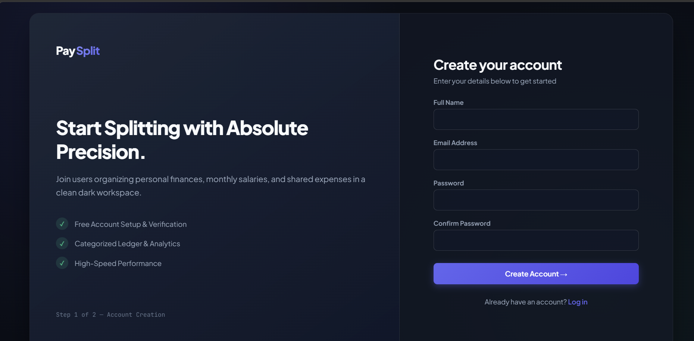
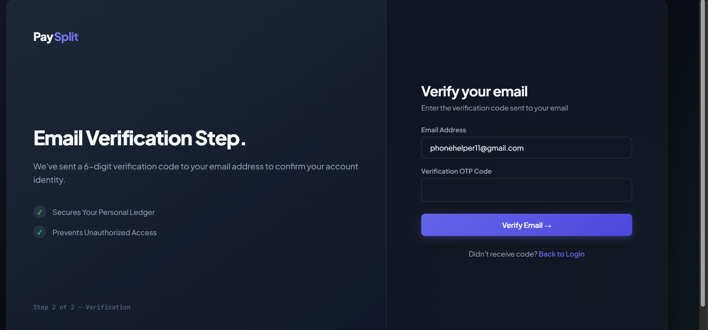
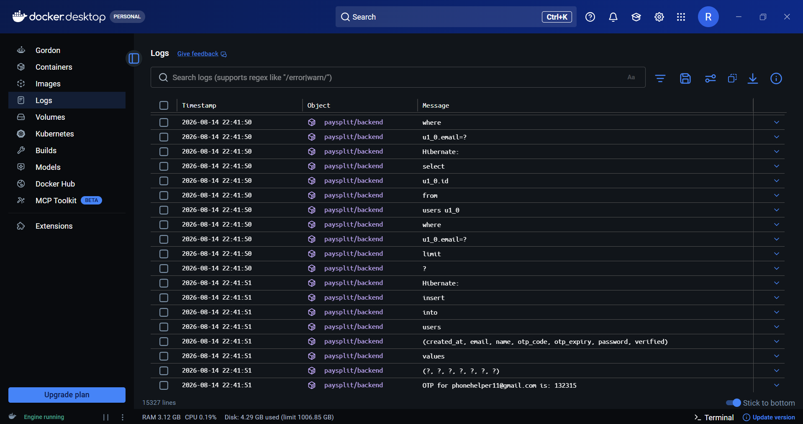
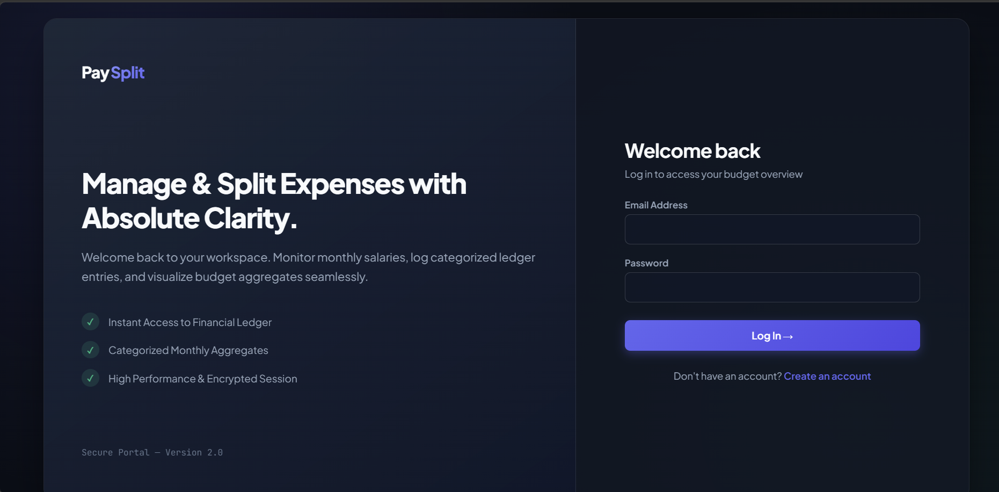
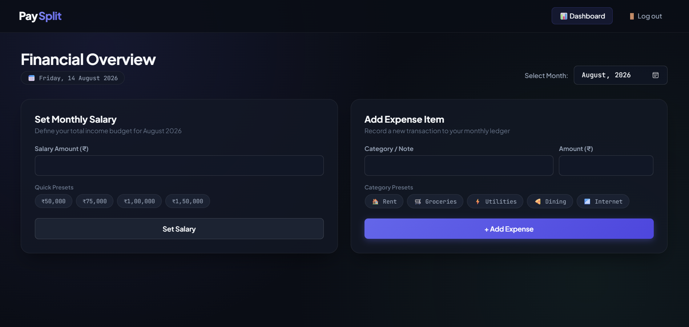
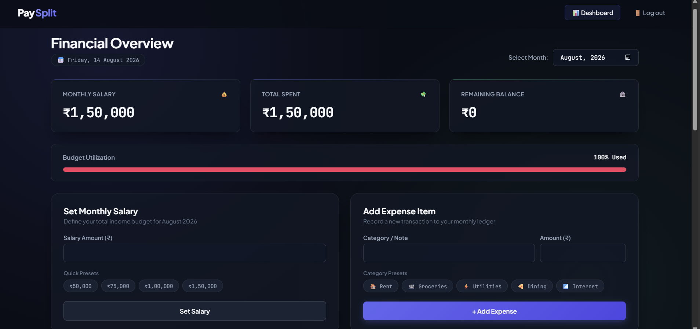
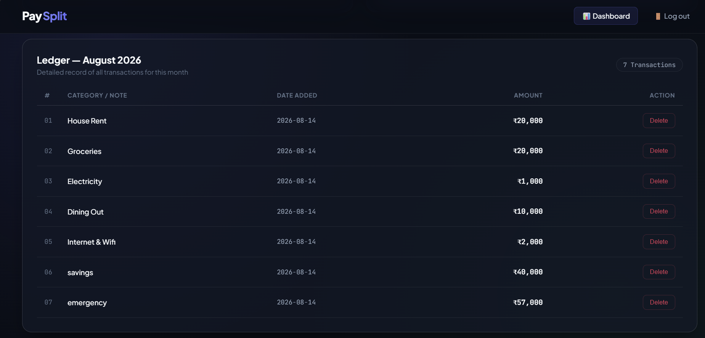
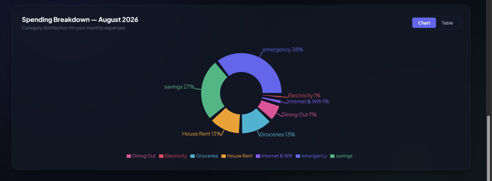
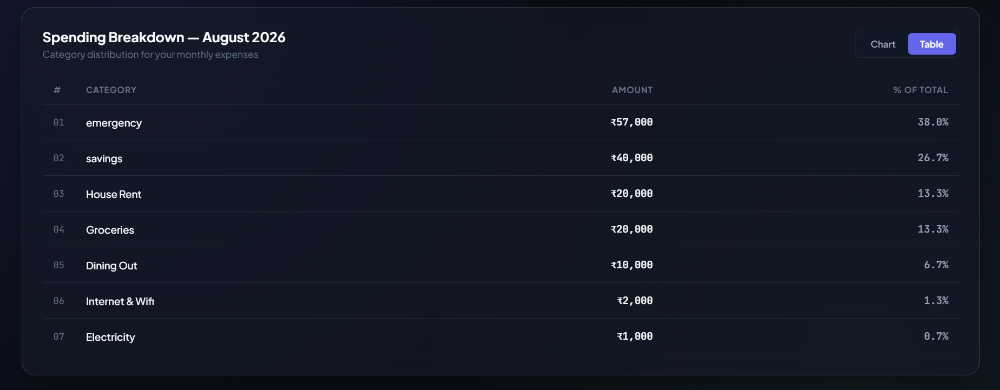

<div align="center">

# 💰 PaySplit — Salary & Expense Tracker

> A modern, full-stack personal financial management and expense analytics platform built with the **MERN** stack (MongoDB, Express, React, Node.js). Designed to help users establish monthly budgets, log categorized transactions, analyze budget utilization, and visualize spending breakdown in real time.

---

## 🌐 Live Demo & Deployment

[](https://salary-and-expense-tracker.netlify.app/)
[](https://render.com)
[](https://cloud.mongodb.com)

| Layer | Hosting Provider | Deployment Status | Live Access |
| :--- | :--- | :---: | :--- |
| **Frontend Application** | **Netlify** | [](https://salary-and-expense-tracker.netlify.app/) | 🔗 [**https://salary-and-expense-tracker.netlify.app/**](https://salary-and-expense-tracker.netlify.app/) |
| **Backend REST API** | **Render** | [](https://render.com) | ⚡ Hosted & running on Render Web Service |
| **Database** | **MongoDB Atlas** | [](https://cloud.mongodb.com) | ☁️ Managed cloud cluster (AWS) |

---

### **Technology Stack Badges**


</div>

---

## 📑 Table of Contents

- [✨ Key Features](#-key-features)
- [📸 Application Walkthrough](#-application-walkthrough)
- [🛠️ Tech Stack Architecture](#️-tech-stack-architecture)
- [📂 Repository Structure](#-repository-structure)
- [🔌 REST API Endpoints](#-rest-api-endpoints)
- [🔐 Environment Variables & Security](#-environment-variables--security)
- [🚀 Local Development Quickstart](#-local-development-quickstart)
- [☁️ Cloud Deployment Guide (Netlify & Render)](#️-cloud-deployment-guide-netlify--render)
- [🛡️ Security Best Practices](#️-security-best-practices)

---

## ✨ Key Features

- 🔐 **Dual-Factor Security**: Email-based OTP verification (10-minute validity) alongside bcrypt-hashed passwords and stateless JWT bearer authentication.
- 🎯 **Monthly Budget Setting**: Set a designated income/salary for any calendar month with one-click quick presets (`$3,000`, `$4,500`, `$6,000`, `$8,000`).
- 💳 **Categorized Expense Logging**: Record spending entries with category presets (*Rent, Groceries, Utilities, Dining, Internet*) and custom descriptions.
- 📊 **Real-Time Financial Metrics**: Instant calculation of **Total Monthly Salary**, **Total Spent**, and **Remaining Available Balance**.
- 📈 **Dynamic Utilization Gauge**: Visual budget progress bar that warns users when approaching or exceeding allocated monthly funds.
- 🍩 **Interactive Spending Visualizations**: Toggle between dynamic **Donut Charts** (powered by Recharts) and detailed **Tabular Summaries** with calculated percentage allocations.
- ⚡ **Dual Database Strategy**: Seamlessly switch between local **MySQL** (via Sequelize) for local development and **MongoDB Atlas** (via Mongoose) for cloud deployment.
- 🌐 **Production-Ready Routing**: Built-in Netlify SPA redirect rules to eliminate 404s on browser reload.

---

## 📸 Application Walkthrough

### **Step 1: Account Creation**
Users register with Full Name, Email, and Password. An encrypted record is created and an OTP code is generated.


---

### **Step 2: Email Verification (OTP)**
Enter the 6-digit verification code to verify email ownership before granting platform access.


---

### **Step 3: Server Logs / OTP Delivery**
During development and testing, OTP codes are logged directly to the server terminal console. In production, transactional email dispatch is supported.


---

### **Step 4: User Authentication (Login)**
Log in using verified credentials to receive a signed JWT token that manages the authenticated user session.


---

### **Step 5: Budget & Expense Input Workspace**
Establish monthly salary benchmarks and add expense line-items with one-click category chips.


---

### **Step 6: Real-Time Financial Dashboard**
Monitor financial health at a glance with live KPI summary cards and budget utilization progress bar.


---

### **Step 7: Transaction Ledger Table**
Inspect a chronological ledger of all monthly transactions with category badges, date timestamps, and single-click deletion.


---

### **Step 8: Interactive Spending Breakdown (Donut Chart)**
Explore visual expenditure proportions by category with dynamic charts rendered via Recharts.


---

### **Step 9: Tabular Spending Breakdown (Detailed Metrics)**
Toggle to tabular mode for precise numeric analysis including category totals and percentage contributions.


---

## 🛠️ Tech Stack Architecture

| Layer | Technologies Used | Description |
| :--- | :--- | :--- |
| **Frontend Framework** | React 19, Vite 8 | Ultra-fast client-side SPA rendering |
| **Client Routing** | React Router v7 | Declarative client routing with protected routes |
| **Data Visualization** | Recharts 3.x | SVG-based responsive charting and donut graphs |
| **HTTP Client** | Axios | Request interceptor automatically attaches JWT token |
| **Backend Runtime** | Node.js (v20+), Express.js 4.x | RESTful API server with modular controllers |
| **Cloud Database** | MongoDB Atlas (Mongoose 8.x) | Managed NoSQL cloud database for production |
| **Local Database** | MySQL (Sequelize 6.x) | Relational SQL option for offline development |
| **Authentication** | JWT (`jsonwebtoken`) + `bcryptjs` | Salted password hashing and secure token auth |
| **CORS & Routing** | `cors`, Netlify `_redirects` | Cross-Origin resource sharing and SPA fallback |

---

## 📂 Repository Structure

```text
Salary And Expense Tracker/
├── backend/
│   ├── config/
│   │   ├── db.js                   # Dual DB connector (MongoDB Atlas / MySQL)
│   │   └── mysql.js                # Sequelize MySQL connection
│   ├── controllers/
│   │   ├── authController.js       # Register, OTP verify, Login logic
│   │   ├── budgetController.js     # Monthly salary budget handlers
│   │   └── transactionController.js# Transaction CRUD and category aggregation
│   ├── middleware/
│   │   └── auth.js                 # JWT bearer token verification middleware
│   ├── models/
│   │   ├── index.js                # Dynamic model exporter based on DB engine
│   │   ├── mongo/                  # Mongoose Schemas (User, Budget, Transaction)
│   │   └── mysql/                  # Sequelize Models (User, Budget, Transaction)
│   ├── routes/
│   │   ├── auth.js                 # /api/auth endpoints
│   │   ├── budget.js               # /api/budget endpoints
│   │   └── transaction.js          # /api/transactions endpoints
│   ├── utils/
│   │   └── emailUtils.js           # OTP generation & email delivery utility
│   ├── .env.example                # Backend environment template
│   ├── .gitignore                  # Backend ignore rules
│   ├── package.json                # Dependencies and npm scripts
│   └── server.js                   # Application entry point & Express setup
├── frontend/
│   ├── public/
│   │   ├── _redirects              # Netlify SPA routing rules
│   │   └── favicon.svg             # Application brand icon
│   ├── src/
│   │   ├── components/             # Reusable UI cards, charts, forms
│   │   ├── pages/                  # Dashboard, Login, Register, VerifyOtp
│   │   ├── services/
│   │   │   └── api.js              # Axios instance with dynamic VITE_API_URL
│   │   ├── App.jsx                 # App routing & Auth guards
│   │   ├── index.css               # Global dark glassmorphism styling
│   │   └── main.jsx                # Application root mount
│   ├── .env.example                # Frontend environment template
│   ├── .gitignore                  # Frontend ignore rules
│   ├── index.html                  # HTML5 template
│   ├── package.json                # Dependencies and npm scripts
│   └── vite.config.js              # Vite build configuration
├── screenshots/                    # All 9 walkthrough visual screenshots
├── .gitignore                      # Top-level workspace gitignore
└── README.md                       # Comprehensive documentation
```

---

## 🔌 REST API Endpoints

### 🔑 Authentication Routes (`/api/auth`)
| Method | Endpoint | Auth Required | Description |
| :---: | :--- | :---: | :--- |
| `POST` | `/api/auth/register` | No | Creates unverified user and sends 6-digit OTP |
| `POST` | `/api/auth/verify-otp` | No | Validates OTP and activates user account |
| `POST` | `/api/auth/login` | No | Authenticates credentials and returns JWT token |

### 💰 Budget Routes (`/api/budget`)
| Method | Endpoint | Auth Required | Description |
| :---: | :--- | :---: | :--- |
| `GET` | `/api/budget/salary/:month` | Yes (JWT) | Retrieves salary budget for specified month (`YYYY-MM`) |
| `POST` | `/api/budget/salary` | Yes (JWT) | Sets or updates monthly salary budget |

### 💳 Transaction Routes (`/api/transactions`)
| Method | Endpoint | Auth Required | Description |
| :---: | :--- | :---: | :--- |
| `GET` | `/api/transactions/:month` | Yes (JWT) | Lists all transactions for specified month |
| `POST` | `/api/transactions` | Yes (JWT) | Creates a new expense entry |
| `DELETE`| `/api/transactions/:id` | Yes (JWT) | Deletes an expense by ID |
| `GET` | `/api/transactions/summary/:month` | Yes (JWT) | Returns total salary, total spent, and balance |
| `GET` | `/api/transactions/aggregate/category/:month` | Yes (JWT) | Returns category-wise breakdown with totals |

---

## 🔐 Environment Variables & Security

### Backend (`backend/.env`)
Create a `.env` file inside `backend/` using `backend/.env.example`:

```env
NODE_ENV=production
PORT=5000
CLIENT_URL=https://your-app-name.netlify.app

# MongoDB Atlas URI (Production)
MONGO_URI=mongodb+srv://<username>:<password>@cluster0.xxxxx.mongodb.net/salary_expense_db?retryWrites=true&w=majority

# JWT Session Configuration
JWT_SECRET=your_super_secret_jwt_key_minimum_32_characters
JWT_EXPIRES_IN=7d

# Optional SMTP Email Configuration
EMAIL_HOST=smtp.gmail.com
EMAIL_PORT=587
EMAIL_USER=your_email@gmail.com
EMAIL_PASS=your_app_password
```

### Frontend (`frontend/.env`)
Create a `.env` file inside `frontend/` using `frontend/.env.example`:

```env
# Local Development
VITE_API_URL=http://localhost:5000/api

# Production (Set inside Netlify Environment Variables dashboard)
# VITE_API_URL=https://your-backend-api.onrender.com/api
```

---

## 🚀 Local Development Quickstart

### 1. Clone the repository
```bash
git clone https://github.com/<your-username>/<your-repo-name>.git
cd "Salary And Expense Tracker"
```

### 2. Configure Backend
```bash
cd backend
npm install
cp .env.example .env
# Edit .env with your MongoDB Atlas URI or MySQL credentials
npm run dev
```
*Backend runs on `http://localhost:5000`.*

### 3. Configure Frontend
Open a second terminal window:
```bash
cd frontend
npm install
npm run dev
```
*Frontend runs on `http://localhost:5173`.*

---

## ☁️ Cloud Deployment Guide (Netlify & Render)

### 🌐 Frontend Deployment (Netlify)
1. Push your repository to GitHub.
2. In Netlify, click **"Add new site"** → **"Import an existing project"** → Select your GitHub repository.
3. Configure build settings:
   - **Base directory**: `frontend`
   - **Build command**: `npm run build`
   - **Publish directory**: `frontend/dist`
4. Under **Site configuration** → **Environment variables**, add:
   - `VITE_API_URL`: `https://your-backend-api.onrender.com/api`
5. Click **"Deploy Site"**. The included `_redirects` file automatically handles client-side routing.

### ⚙️ Backend Deployment (Render)
1. In Render, select **"New +"** → **"Web Service"** → Connect your repository.
2. Configure service settings:
   - **Root Directory**: `backend`
   - **Environment**: `Node`
   - **Build Command**: `npm install`
   - **Start Command**: `npm start`
3. Under **Environment Variables**, add:
   - `NODE_ENV`: `production`
   - `MONGO_URI`: `mongodb+srv://<user>:<password>@cluster0.xxxxx.mongodb.net/salary_expense_db?retryWrites=true&w=majority`
   - `JWT_SECRET`: `your_random_secret_string`
   - `JWT_EXPIRES_IN`: `7d`
   - `CLIENT_URL`: `https://your-netlify-app.netlify.app`
4. Click **"Create Web Service"**.

---

## 🛡️ Security Best Practices

- 🔒 **Secrets are Ignored**: Both root and subfolder `.gitignore` files prevent any `.env` files from ever being committed to Git.
- 🔑 **Encrypted Passwords**: All user passwords are automatically hashed with salted `bcryptjs` before storage.
- ⏱️ **Expiring OTP Tokens**: Verification codes expire automatically after 10 minutes to prevent brute-force attacks.
- 🛡️ **JWT Bearer Protection**: Private routes strictly require a valid JSON Web Token in the `Authorization: Bearer <token>` header.
- 🌐 **Origin Whitelisting**: CORS is restricted to your authorized frontend clients in production.

---

<div align="center">
  <sub>Built with ❤️ using the MERN Stack. Designed for precision financial planning.</sub>
</div>
